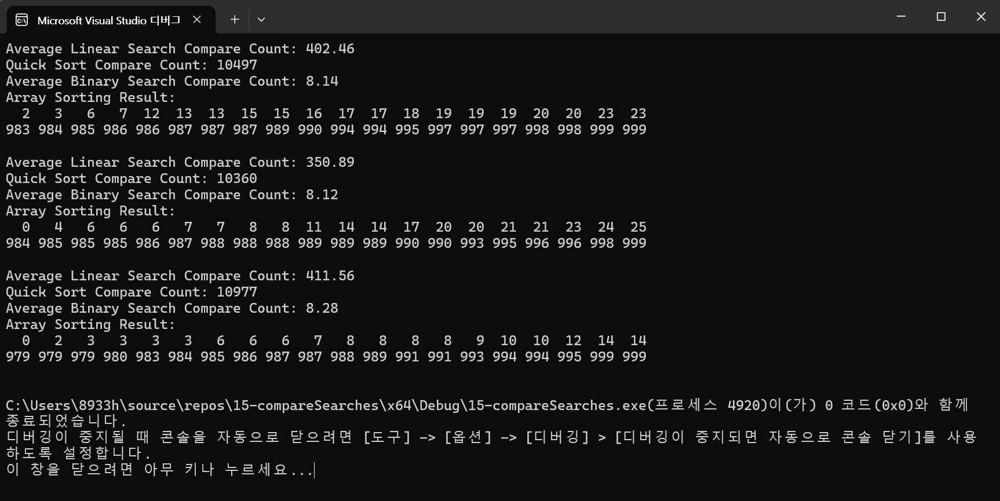

# A,B,C 에 대해 퀵 정렬후의 이진 탐색에서 순차탐색보다 적게 비교 하는 이유를 설명
우선 알고리즘의 차이가 있는데 순차 탐색은 첫 번째의 요소부터 시작해서 원하는 값을 얻을 때 까지 모든 요소를 비교 합니다.
배열이 정렬되지 않을때도 가능하지만, 배열의 크기에 따라서 비교 횟수는 증가(비례)합니다. 최악으로느 배열의 끝까지 탐색
해야해서 비교 횟수는 SIZE 입니다. 
이진 탐색은 정렬된 배열에서 중간값이랑 비교하여 탐색의 범위를 줄여갑니다. 만약 중간값이 원하는 목표값보다 크게 되면
왼쪽 절반을 탐색하고, 중간 값이 목표값보다 작으면, 오른쪽 절반을 탐색합니다. 매 단계마다 탐색의 범위가 줄어들기 때문에
비교 횟수는 O(log2(N))으로 작습니다.
그리고 퀵 정렬은 데이터를 정렬해가면서 이진 탐색이 가능하도록 준비를 합니다. 정렬 과정에서 비교 횟수는 많을 수는 있지만,
한번 수행하면 이후의 탐색 효율이 매우 증가합니다. 순차 탐색은 정렬의 여부와는 상관없이 모든 요소를 비교하기 때문에 비효율적입니다.

# Result image

